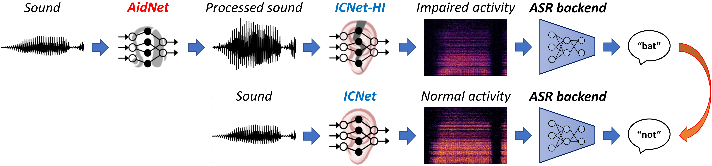

### AidNet: A DNN-based hearing aid for optimal restoration of central neural coding

This repository contains the source code of AidNet, a deep-learning-based model developed to restore impaired neural activity in the inferior colliculus (IC). The example AidNet model was trained to compensate for the hearing impairment of an example noise-exposed animal with a symmetric, mild, high-frequency hearing loss. An example Jupyter notebook `AidNet_example.ipynb` is included that can be used to process any sound using the provided AidNet model. A Google Colab version of the notebook can also be found [here](https://colab.research.google.com/drive/1iyJmhtX9c1OJ8LvsNw-KfrRf2L92BdY6?usp=sharing) and can be executed without a local Python installation. The supporting work can be cited as follows:
> Drakopoulos, F., Pellatt, L., Sabesan, S., Xia, Y., Gong, T., Fragner, A. & Lesica, N. A. (2026). Optimal hearing aid design through restoration of the neural code.

The *AidNet* folder contains the deep-neural-network (DNN) architecture, weights and configuration parameters of the pre-trained AidNet model. The *src* folder contains all the supplementary Python functions to execute AidNet. This repository also contains an example sound file `scribe_male_talker.wav` from the [UCL SCRIBE dataset](http://www.phon.ucl.ac.uk/resource/scribe), a pre-compiled Python version of the provided Jupyter notebook `AidNet_example.py`, this `README.MD` document and a license file. The repository can be used together with the [ICNet repository](https://github.com/fotisdr/ICNet) to simulate neural activity in the IC. 

<p align="left">
    
</p>


## How to use the AidNet model

To run the example Jupyter notebook and the AidNet model, it is necessary to install the Python packages included in `requirements.txt`. We recommend installing [conda](https://www.anaconda.com/download) and executing the following commands:

```
conda create --name AidNet python=3.11
conda activate AidNet
pip install -r requirements.txt
```

The first two commands are used to create (and activate) a new conda environment named `AidNet` with Python v3.11. If using only Python (without conda), running the last command is sufficient to install all necessary packages.
The example Jupyter notebook can then be executed on Jupyter lab by running `jupyter lab &`, selecting the `AidNet_example.ipynb` notebook and running all cells.

----

## Citation
If you use this code, please cite the corresponding paper or this repository:

> Drakopoulos, F., Pellatt, L., Fragner, A. & Lesica, N. A. (2024). AidNet: A DNN-based hearing aid for optimal restoration of the neural code (v1.0). Zenodo. .

DOI

##
For questions, please reach out to one of the corresponding authors:

* Fotios Drakopoulos: f.drakopoulos@ucl.ac.uk
* Nicholas A Lesica: n.lesica@ucl.ac.uk

> This work was supported by UK EPSRC EP/W004275/1, BBSRC BB/Y008758/1 and MRC MR/W019787/1.
